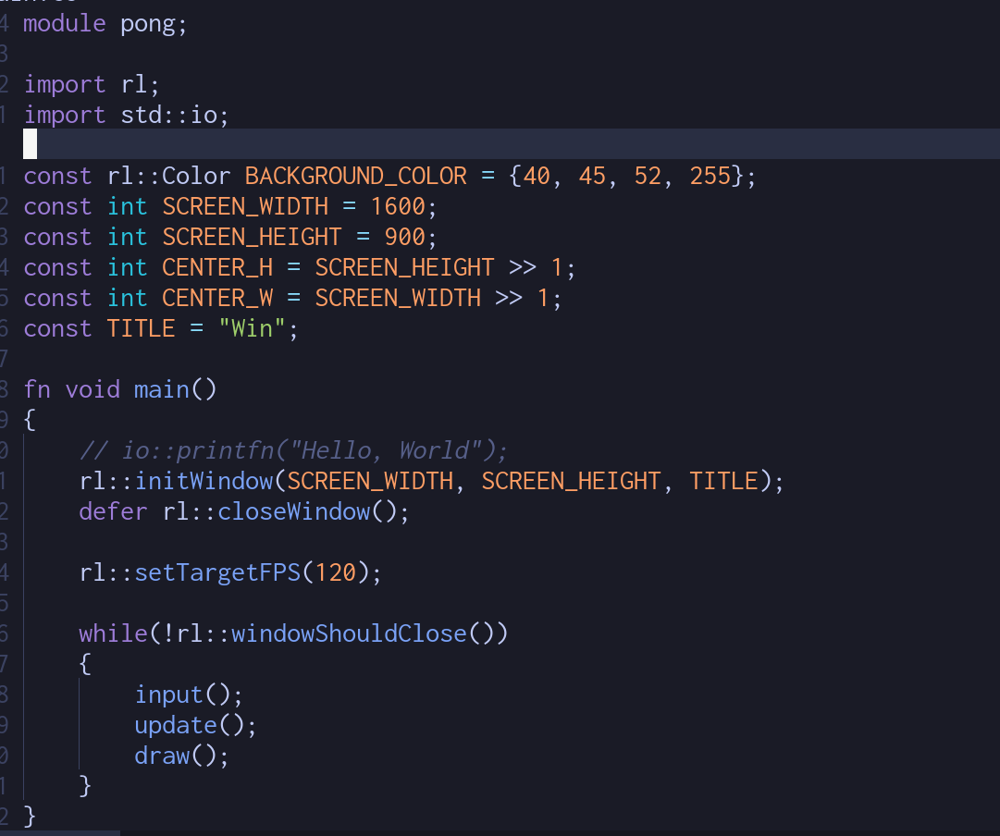

# C3.vim
Syntax highlighting for C3's programming language
Derived from [Tetralux/odin.vim](https://github.com/Tetralux/odin.vim).

### What it looks like. 

## TODO 

Some missing stuff:

- \u012f and \U0123fabc escape sequences should be added for strings.
- Double `` converts to a single, non-terminating, ` in raw strings.
- C3 has two ranges, the inclusive a..b and the start-length: a:b. This latter - doesn't seem supported.
- Optional types are the regular type names suffixed with !, e.g. int!
- There is normal C ternary, i.e. a ? b : c but also the binary a ?: b and a ?? - b (the last one is same as Odin's or_else)

Compile time keywords seem to be missing:
    $alignof, $assert, $case, $checks, $default, $defined, $echo, $else, $endfor, $endforeach, $endif, $endswitch, $error, $eval, $evaltype, $extnameof, $for, $foreach, $if, $include, $nameof, $sizeof, $stringify, $switch, $typeof, $typefrom, $qnameof, $vacount, $vaconst, $vatype, $vaarg, $varef, $vaexpr, $vasplat

## Installation

Simply clone the repository into your Vim's package directory. (Vim must be installed from https://www.vim.org.)
If using [Pathogen](https://github.com/tpope/vim-pathogen), clone it into the `bundle` folder within Vim's package directory, instead.

Note that the package directory is located in `%USERPROFILE%\vimfiles` on Windows,
and `~/.vim` on Unix.

## Optional features

Not everyone wants certain features, like function call highlighting.

You can enable or disable the relevant features by searching the repository for the appropriate code tags, and commenting out the adjacent lines.
The Vim comment character is `"`.

| Description                                | Code tag to search for  |
|--------------------------------------------|-------------------------|
| Function call and declaration highlighting | `:FunctionHighlighting` |
